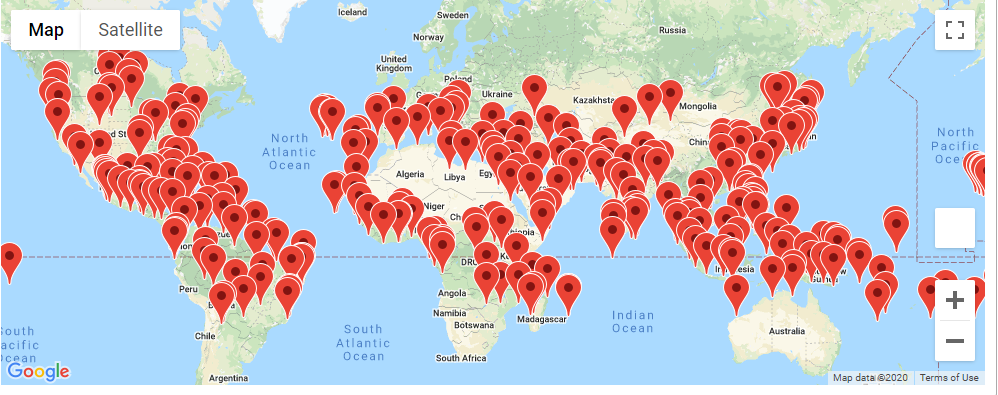
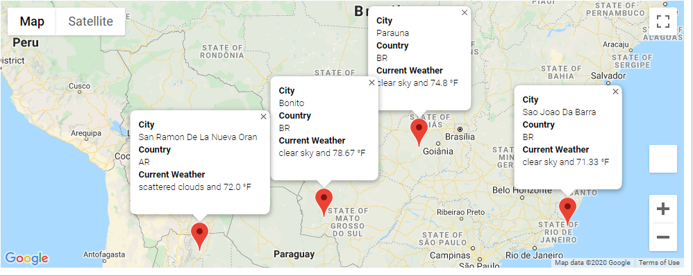
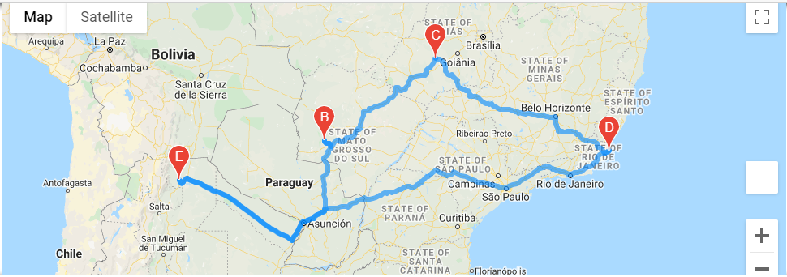

# World Weather Analysis

## Overview of Project

### Purpose
To generate a map with a few hundred random cities to show location and current weather information. Then allow a user to enter their weather preferences to identify potential travel destinations and nearby hotels. Last, using these potention desitinations, create a possible travel route for 4 cities including the weather information for each city.

## Results
The following tools are included in this repository
- CSV file of 687 random cities, with their respective current weather information.

- CSV file of 290 cities pulled from the Weather Database with maximum temperatures between 70 and 90 degrees.

- Vacation Map

- Vacation Itinerary Route

- Vacation Itinerary Map with Markers
